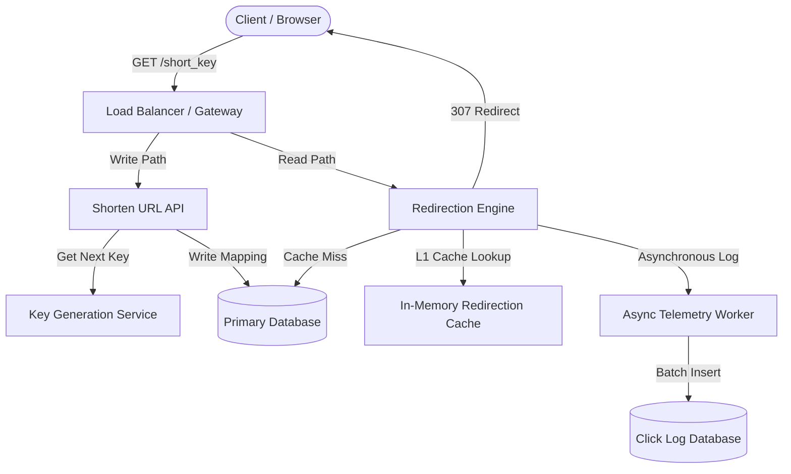

# AlpURL System Architecture

This document describes the architectural layout, core design decisions, and system design patterns of **AlpURL**—designed to serve 100M Daily Active Users with sub-10ms redirection latencies.

---

## 1. System Overview

AlpURL separates the critical read path (redirection) from the write path (shortening) and logging path (telemetry) to maximize scalability and eliminate locking bottlenecks.

---

## 2. Core Subsystems

### A. Key Generation Service (KGS)
To prevent duplicate key collisions and avoid querying the database on every shorten request (which chokes writing throughput), AlpURL implements a **Key Generation Service**.
- **Block Allocation**: The coordinator allocates sequential counter blocks (e.g., 1000 keys) to active API worker instances.
- **In-Memory Generation**: Local instances consume keys from their pre-allocated block in memory. When the block drops below a threshold, the instance pre-fetches the next block asynchronously.
- **Base62 Encoding**: Integers are encoded into a Base62 alphabet (`0-9`, `a-z`, `A-Z`) resulting in short, highly dense 6-character strings.

---

## 3. High Performance Strategies

### Caching Layer (Sub-10ms Read SLA)
- **L1 Local Cache**: Active mappings are cached inside each worker instance memory. 
- **Warm-Up routine**: Upon engine startup, the top 1000 most active/recently created URL mappings are pre-loaded from SQLite to eliminate cold starts.
- **Redirection**: On cache hit, the response returns instantly in <8ms, avoiding I/O overhead.

### Decoupled Telemetry Ingestion
Write amplification occurs when redirect logs are written synchronously on every read. AlpURL decouples this:
1. Redirection engine extracts request metadata (Browser, OS, Device, Referrer).
2. It sends the redirect response `307 Temporary Redirect` immediately.
3. The click telemetry task is delegated to an asynchronous background worker using FastAPI's task runner, keeping read endpoints lightning fast.
4. The worker writes logs to the analytics table in batches.
