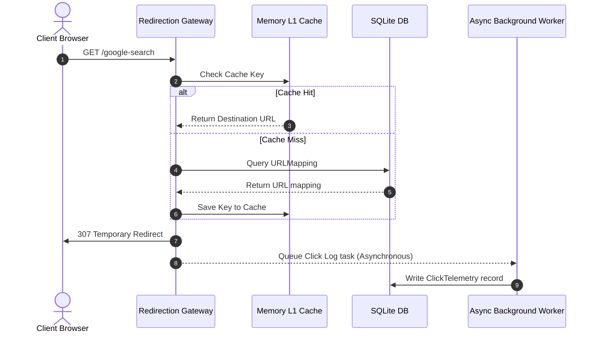

# AlpURL

<div align="center">


**Short Links. Smart Connections. Infinite Possibilities.**

*An Enterprise-Grade, AI-Powered Distributed URL Management Platform designed to handle billions of redirects with sub-10ms response latencies.*

[](LICENSE)
[](#)
[](#)
[](https://fastapi.tiangolo.com)
[](#)
[](CONTRIBUTING.md)

</div>

---

## 📖 Project Description

**AlpURL** is a premium, cloud-native URL shortening and link intelligence platform. Built with a distributed systems mindset, it utilizes gold-standard architectural patterns like **Key Generation Service (KGS)** pre-allocation, decoupled **Asynchronous Telemetry Ingestion**, and **Multi-Layer Cache Warm-Ups** to serve traffic at massive scale (100M+ writes/day) without database locks or latency degradation.

The client interface is a gorgeous, fully-responsive SPA styled with a premium glassmorphic dark theme and custom-configured Tailwind UI, rendering real-time performance analytics graphs.

### Why AlpURL?
* **Zero Database Locks**: Collision-free keys are pre-allocated in memory, bypassing database checks during shortening.
* **Instant Redirection (<10ms)**: Redirections are served from regional/local caches with background analytics queues.
* **Granular Telemetry**: Captures operating systems, browser engines, device factors, and referrer details out of the box.
* **Production Ready**: Full Docker, Docker Compose, Kubernetes manifests, and automated GitHub CI workflows.

---

## ✨ Features

* **Pre-allocated Key Generation**: Thread-safe KGS block reservation preventing ID collision.
* **High-Speed Redirection Engine**: Serves redirects instantly and updates local memory mappings.
* **Decoupled Telemetry Logging**: Background workers write clicks to database asynchronously.
* **Premium Glassmorphic Dashboard**: Real-time traffic tracking, device breakdown, and referrers via Chart.js.
* **Custom Aliasing & TTL**: Dynamic expiration intervals and custom handles.
* **Dockerized Workflows**: One-command initialization for backend and frontend.

---

## 🛠️ Technology Stack

| Component | Technology | Version | Purpose |
| :--- | :--- | :--- | :--- |
| **Backend Engine** | FastAPI | `0.110+` | High-performance async API Gateway |
| **Server Runtime** | Uvicorn | `0.28+` | ASGI Web Server |
| **ORM / DB Driver**| SQLAlchemy | `2.0+` | Database mapping and session management |
| **Telemetry Parsing**| ua-parser | `0.18+` | User-agent browser/device parsing |
| **Database** | SQLite | - | Relational storage (Production ready for Postgres) |
| **Frontend UI** | HTML5 / JS | - | Single Page Application |
| **Styling** | Tailwind CSS | `v3/v4` | Glassmorphism Utility Theme |
| **Analytics Charts**| Chart.js | `4.x` | Real-time telemetry visualization |
| **Testing** | pytest | `8.x` | Unit and integration test suite |

---

## 📐 Architecture Overview

AlpURL is architected to separate **reads**, **writes**, and **analytics** into decoupled, non-blocking lanes.

### System Redirection Flow


---

## 📂 Project Structure

```text
AlpURL/
├── backend/                   # Python/FastAPI Application
│   ├── app/                   # Source Packages
│   │   ├── __init__.py
│   │   ├── main.py            # App Setup, Routing, and Cache
│   │   ├── kgs.py             # Key Generation Service range coordinator
│   │   ├── database.py        # SQLAlchemy engine and Models
│   │   ├── telemetry.py       # Asynchronous ua-parser logger
│   │   └── schemas.py         # Pydantic validation schemas
│   ├── tests/                 # Suite testing
│   │   ├── __init__.py
│   │   └── test_main.py       # Pytest test cases
│   └── requirements.txt       # Dependencies
├── frontend/                  # Static SPA Files
│   ├── index.html             # Dashboard structure
│   ├── style.css              # Custom styles
│   └── app.js                 # Chart.js sync & Form handling
├── docs/                      # Architectural documents
│   ├── ARCHITECTURE.md
│   ├── 01_project_initialization.md
│   └── 02_vision_validation.md
├── docker/                    # Deployment containers
│   ├── Dockerfile.backend
│   └── docker-compose.yml
├── kubernetes/                # Container Orchestration
│   ├── deployment.yaml
│   └── service.yaml
├── .github/                   # GitHub Community Workflows
│   ├── workflows/
│   │   └── ci.yml             # GitHub Actions CI
│   ├── ISSUE_TEMPLATE/        # Issue trackers
│   │   ├── bug_report.md
│   │   └── feature_request.md
│   ├── PULL_REQUEST_TEMPLATE.md
│   ├── dependabot.yml
│   └── CODEOWNERS
├── README.md
├── LICENSE
├── .gitignore
├── CHANGELOG.md
├── ROADMAP.md
├── CONTRIBUTING.md
├── CODE_OF_CONDUCT.md
├── SECURITY.md
└── run.py                     # Local launcher script
```

---

## 🚀 Installation & Local Development

### Prerequisites
* **Python 3.10+** (Tested on `3.14`)
* **Docker & Docker Compose** (Optional, for containers)

### 1. Local Development Setup
Clone the repository and run the local orchestration script to automatically initialize the virtual environment, install requirements, and boot the server:

```bash
# Clone the repository
git clone https://github.com/Praval07/AlpURL.git
cd AlpURL

# Launch the app local runner
py run.py
```
Open your browser to `http://localhost:8000` to interact with the dashboard.

### 2. Running with Docker Compose
To boot the complete containerized stack in one command:

```bash
docker-compose -f docker/docker-compose.yml up --build
```
This mounts the local `frontend/` folder into the backend's static context, exposing the server on port `8000`.

---

## 📡 API Documentation

### Base URL: `http://localhost:8000`

| Method | Endpoint | Description | Payloads / Params |
| :--- | :--- | :--- | :--- |
| **POST** | `/api/shorten` | Shortens a URL using KGS or custom alias | `{"long_url": "...", "custom_alias": "optional", "expiry_hours": 24}` |
| **GET** | `/api/dashboard-stats` | Fetches global metrics and recent link metadata | None |
| **GET** | `/api/stats/{short_key}` | Retrieves redirection logs for a specific key | None |
| **GET** | `/{short_key}` | High-speed redirect endpoint (performs redirect and queues log) | None |

---

## 🧪 Testing

To run the unit test suite validation locally:

```bash
# Activate your virtual environment
.venv/Scripts/activate

# Execute pytest checks
pytest backend/tests/
```

---

## 🛡️ Security & Performance

* **L1 Cache Warm-Up**: Loads active keys into memory at startup, minimizing disk queries for active redirections.
* **Input Validation**: Strict schema verification via Pydantic (`custom_alias` accepts regex `^[a-zA-Z0-9\-_]+$`).
* **Decoupled Telemetry**: Thread-safe SQL logging isolates DB writing from redirection response threads.
* **Auto-Expire (TTL)**: Default TTL of 2 years prevents data bloat.

---

## 🤝 Contributing

Contributions make the open-source community amazing! Please read our [Contributing Guide](CONTRIBUTING.md) and [Code of Conduct](CODE_OF_CONDUCT.md) before submitting pull requests.

### Git Commit Strategy
We enforce conventional commits:
* `feat:` (new features)
* `fix:` (bug fixes)
* `docs:` (documentation updates)
* `chore:` (dependency updates, environment tweaks)

---

## 📄 License

Distributed under the MIT License. See [LICENSE](LICENSE) for details.

---

## 📞 Support & Acknowledgements
* **Creator**: Praval Saxena
* **Email**: [rapidrevisionhub@gmail.com](mailto:rapidrevisionhub@gmail.com)
* Built with ❤️ for high-performance distributed systems engineering portfolios.
